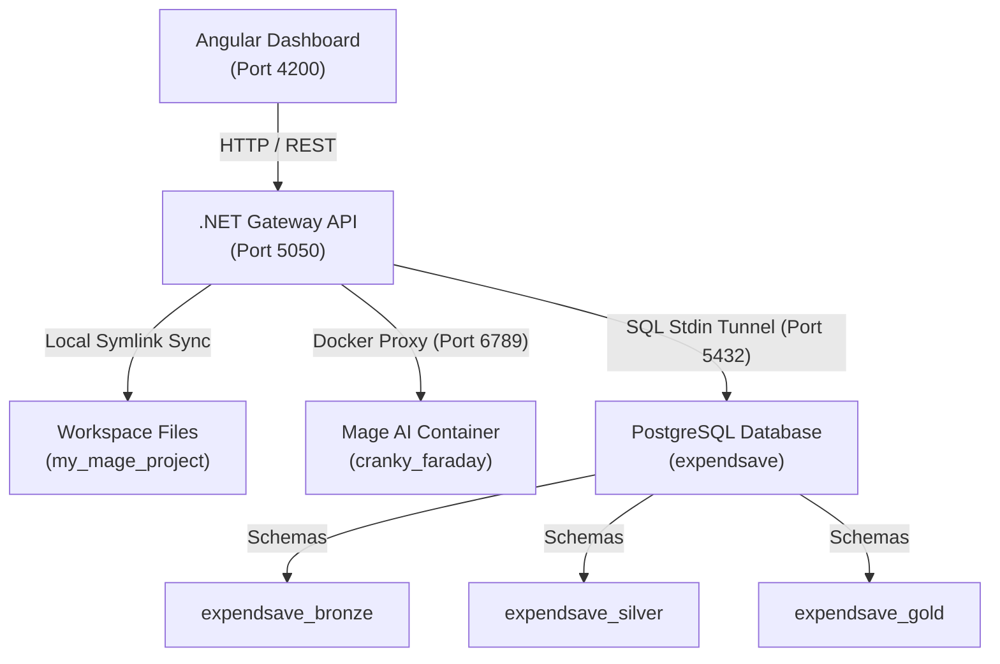

# Mage Medallion Data Engineering GUI Platform

A premium, unified data engineering control center built with a modern **Angular frontend** and a high-performance **.NET Minimal API Gateway**. This platform provides visual orchestration for medallion-based data pipelines, dbt staging models, SQL consoles, and Apache Superset business intelligence dashboards.

---

## 🚀 Key Features

* **Interactive Notebook IDE**: Features a local-first **Monaco Editor** with multi-language support (Python, SQL), typewriter line-focus highlighting, and automated reflowing.
* **Premium Drag-to-Resize Layout**: Includes a custom click-and-drag divider border. Hovering over the terminal border lights up an emerald green indicator line, allowing you to dynamically adjust the console panel height (Monaco reflows instantly).
* **Meditative Medallion Workflow**: Organizes and transforms raw datasets systematically across three layers:
  * **Bronze (Raw Ingestion)**: Ingests raw JSON documents from MongoDB or relational records from MySQL directly into raw PostgreSQL staging schemas.
  * **Silver (Cleaned & Conformed)**: SQL views/tables that cleanse, deduplicate, cast datatypes, and apply primary keys in the `expendsave_silver` schema.
  * **Gold (Business Aggregations)**: Curated, high-value KPI aggregations and forecasting views for dashboard reporting.
* **Dynamic Lineage DAG Flow**: Scans your medallion directories on the fly and renders an interactive Directed Acyclic Graph (DAG) with **animated Bezier curves** showing how data flows from Bronze loaders to Silver tables.
* **Database Inspection Hub**: Connects directly to local PostgreSQL to list discovered schemas/tables, trigger data previews (up to 100 rows), and display formatted spreadsheets in the **Data Grid Preview**.
* **Zero-Configuration Real-time Workspace Sync**: A symbolic link architecture binds your VS Code local workspace with the running Docker container mount folder (`/Users/santhoshsl/custom-fabric-platform/my_mage_project/`). Any file creation, modification, or removal updates instantly in both environments.

---

## 🛠️ Project Architecture



### Components:
1. **Frontend (`mage-frontend`)**: Written in Angular, utilizing styled panels, glassmorphism UI elements, and custom CSS-deep third-party styling overrides.
2. **Backend (`MageGateway`)**: A C# web gateway running on port **`5050`** (avoiding standard macOS Control Center port 5000 conflicts). It tunnels SQL statements safely to PostgreSQL via a command-line stdin pipe to preserve query strings.
3. **Mage AI Container (`cranky_faraday`)**: Docker runtime executing Python data loaders and orchestrating job queues.

---

## 🏁 Getting Started

### Prerequisites:
1. **Docker**: Ensure the Mage AI container is running:
   ```bash
   docker start cranky_faraday
   ```
2. **PostgreSQL**: Ensure local Postgres is active on port `5432` with a database named `expendsave` (username/password: `postgres`/`postgres`).
3. **MongoDB**: Ensure local MongoDB is active on port `27017` with database `expendsave`.

### Launching the Platform:
Run the launch script from the project root. This concurrently starts the C# Minimal API and the Angular Web dev server:
```bash
./start_platform.sh
```

Access the platform at: **[http://localhost:4200](http://localhost:4200)**.

---

## 📂 Project Directory Structure

Your workspace directories are dynamically mapped between your local project folder and your Docker environment:
```text
my_mage_project/
├── bronze/                         # Python MongoDB ingestion scripts
│   ├── ingest_mongodb_goals.py
│   ├── ingest_mongodb_investmentschemes.py
│   ├── ingest_mongodb_transactions.py
│   └── ingest_mongodb_users.py
├── silver/                         # SQL Silver layer staging scripts
│   ├── stg_investment_schemes.sql
│   ├── stg_transactions.sql
│   └── stg_users.sql
├── gold/                           # SQL Gold layer KPI views
│   ├── fact_investment_opportunities.sql
│   ├── fact_monthly_spending_alerts.sql
│   └── fact_user_financial_profile.sql
└── dbt/                            # dbt transformation models
```

---

## 📝 Guide: Connecting Database to Apache Superset

To visualize your medallion layers in Superset, you need to register your local PostgreSQL database inside the Superset interface:

1. Go to the **Superset Embed** tab in the GUI.
2. Click **Settings** (top-right corner of the embedded Superset header) ➔ **Database Connections**.
3. Click the green **`+ DATABASE`** button.
4. Select **PostgreSQL** as your database engine.
5. Enter the connection settings:
   * **Host**: `host.docker.internal` *(Note: Since Superset runs inside Docker, it must use this bridge domain to reach your local host database)*
   * **Port**: `5432`
   * **Database Name**: `expendsave`
   * **Username / Password**: `postgres` / `postgres`
6. Click **Connect**, then **Save**. 
7. You can now build interactive charts using tables from the `expendsave_bronze`, `expendsave_silver`, and `expendsave_gold` schemas!
