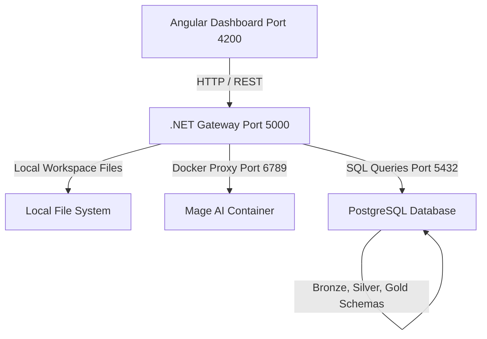

# Mage Medallion Data Engineering GUI Platform

A premium, custom data engineering portal built with an **Angular frontend** and a **.NET Web API backend**. This platform acts as a unified control center for orchestrating medallion-based pipelines using **Mage AI**, database ingestion, dbt transformations, and data visualization.

---

## 🚀 Key Features

* **Interactive Notebook Editor**: A fully integrated Monaco Editor with typewriter cursor focus, code execution logging, and multi-language support (Python and SQL).
* **Meditative Medallion Workflow**: Manages your data lifecycle in strict accordance with medallion architecture layers:
  * **Bronze (Raw Ingestion)**: Ingests documents from sources like MongoDB (Local / Atlas) or MySQL into raw PostgreSQL staging schemas.
  * **Silver (Cleaned & Conformed)**: Transformations and staging models inside `dbt/models/silver/`.
  * **Gold (Business Aggregations)**: Analytical exports and business metrics inside `dbt/models/gold/`.
* **Dynamic Lineage DAG Builder**: Scans your local workspace directories on the fly and dynamically draws the dependency lineage tree. 
  * Automatically maps Silver models to their respective Bronze upstream dependencies via substring matching.
  * Dynamically maps Gold aggregates to their Silver upstream transformer models.
* **Database Inspection Hub**: Explore your active Postgres project schemas, list tables, and preview data grids directly inside the terminal console panel.
* **100% Offline Monaco Configuration**: Monaco Editor assets are bundled and served locally from the web server, completely bypassing external CDN blocks or firewall timeouts.

---

## 🛠️ Project Architecture



### Components:
1. **Frontend (`mage-frontend`)**: Built with Angular, Tailwind, and custom premium slate-50 light themes.
2. **Backend (`MageGateway`)**: A C# Minimal API gateway handling session proxies to Mage, disk file read/writes, Postgres query runners, and dynamic pipeline lineage assembly.
3. **Orchestrator (`Mage AI`)**: Docker container (`cranky_faraday`) handling heavy-lifting pipeline execution runs.

---

## 🏁 Getting Started

### Prerequisites:
1. **Docker**: Ensure your Mage AI container is running:
   ```bash
   docker start cranky_faraday
   ```
2. **PostgreSQL**: Ensure local Postgres is active on port `5432` with a database named `expendsave`.
3. **MongoDB**: Ensure local Mongo is active on port `27017` with database `expendsave`.

### Quickstart Command:
Run the platform launch script from the project root. This concurrently boots both the C# backend and the Angular dev server:
```bash
./start_platform.sh
```

Once running, access the dashboard at: **[http://localhost:4200](http://localhost:4200)**.

---

## 📂 Medallion Directory Layout
Workspace files are mapped from the directory set in your Settings panel (defaults to `./my_mage_project/`):
```text
my_mage_project/
├── bronze/                         # Python/SQL raw ingestion scripts
│   ├── ingest_goals.py
│   └── ingest_transactions.py
├── dbt/
│   └── models/
│       ├── silver/                 # SQL transformation dbt staging files
│       │   └── stg_transactions.sql
│       └── gold/                   # SQL business metrics files
│           └── savings_by_month.sql
```

---

## 📝 Creating your First Ingestion Pipeline

1. Click **`➕ New Project Schema`** in the top header. This automatically initializes the target schemas (`my_project_bronze`, `my_project_silver`, `my_project_gold`) in PostgreSQL.
2. Open the **Notebook Editor** tab.
3. Click **`➕ New File`** in the file sidebar and create an ingestion script (e.g. `bronze/ingest_users.py`).
4. Paste your MongoDB ingestion script in the Monaco Editor.
5. Click **`▶ Run Code`**. The script will execute inside the Mage runner and load the data.
6. Check your new tables under the **`🗄️ Database Tables`** tab.
7. Switch to the **`Pipeline Lineage`** tab to see your new Bronze node mapped in the DAG!
