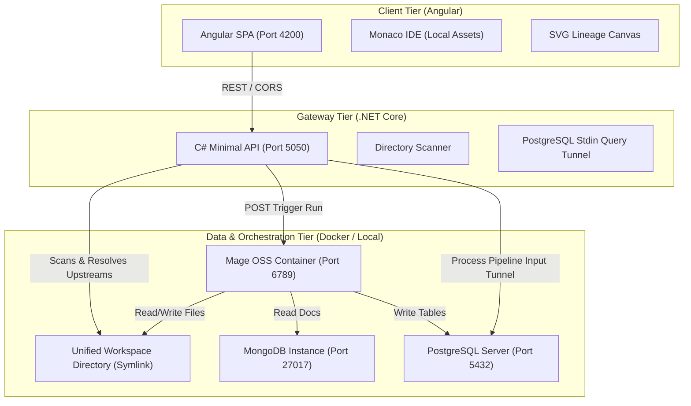
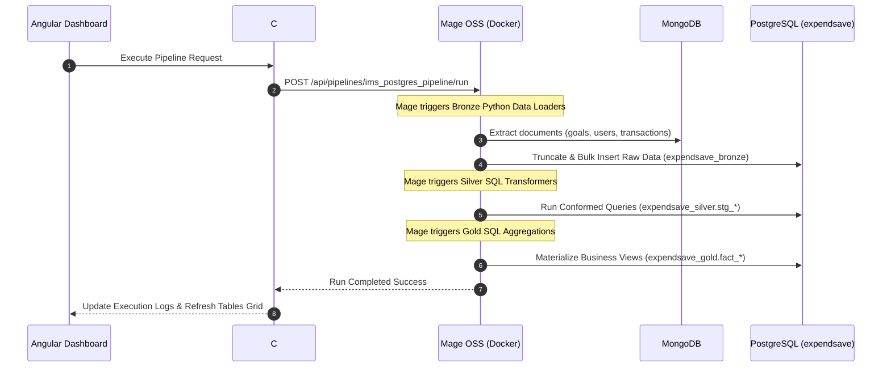

# ExpendSave Medallion Data Engineering Control Center: Architecture & Blueprint

This document provides a comprehensive blueprint and deep-dive technical guide for the custom Data Engineering Portal. It details the system architecture, file structure, execution workflow, and how **Mage OSS** acts as the central orchestrator to tie ingestion, transformation, and database management together.

---

## 🗺️ 1. System Blueprint & Core Architecture

The platform is designed as a **decoupled multi-tier architecture** that bridges local development folders, Docker containers, and live databases.



### Architectural Tiers:
1. **Client Tier (`mage-frontend`)**: A single-page application built on Angular. It hosts the Monaco editor, database inspection grids, and the dynamic SVG connection overlay for pipeline DAGs.
2. **Gateway Tier (`MageGateway`)**: A C# Minimal API running on port `5050` that manages local file systems, performs SQL execution via stdin command piping (bypassing parser issues), and proxies execution calls to the Docker container.
3. **Orchestration Tier (`Mage OSS`)**: A Dockerized Mage instance that processes the pipeline definitions, schedules job tasks, and acts as the compute runtime for data loaders.

---

## 🔄 2. Data Engineering Workflow (The Medallion Pipeline)

The platform implements the standard **Medallion (Bronze/Silver/Gold) architecture** using Python data loaders and Postgres SQL views:



---

## 📂 3. Exhaustive Project Directory & File Guide

Below is the directory structure, explaining the role of every key file in your workspace:

### 3.1. Frontend: `mage-frontend/`
* **`src/app/app.ts`**: The main Angular component logic. It manages tab states, handles file tree node interaction, executes C# gateway requests, and calculates dynamic Bezier coordinates for the DAG overlay.
* **`src/app/app.html`**: Defines the user interface. It is divided into:
  1. **Sidebar Navigation**: Switch between tabs.
  2. **Notebook Editor**: Monaco IDE panel + Folder File Tree structure.
  3. **DAG Lineage**: Display of columns with overlay SVG curves.
  4. **Superset Embed**: embedded iframe of Apache Superset.
* **`src/app/app.css`**: Styling rules. Customized with a dark-blue theme (`#0d121f`), glassmorphism cards, and the animated dashed keyframes (`dag-dash`) for active DAG lines.
* **`angular.json`**: Bundles and copies the Monaco editor static scripts locally into the distribution directory, ensuring it functions 100% offline.

### 3.2. Gateway: `MageGateway/`
* **`Program.cs`**: The brain of the API.
  * **`/api/workspace`**: Scans the directory tree recursively.
  * **`/api/workspace/file`**: Reads/writes text files (supporting creation of python/sql blocks).
  * **`/api/db/query`**: Spawns a background `psql` process and streams raw SQL queries via standard input to safely execute multi-line statements.
  * **`/api/pipelines`**: Scans `bronze/`, `silver/`, and `gold/` folders. It implements a normalization matcher (`NormalizeBlockName`) to map file suffixes/prefixes (e.g., `ingest_mongodb_users` ➔ `stg_users`) and construct DAG dependencies.
* **`appsettings.json`**: Configures port settings, database connection strings, and base repository paths.
* **`templates/`**: Hosts boilerplate templates (e.g., `mongodb.py`) loaded when a user clicks `+ New File` inside the notebook panel.

### 3.3. Workspace: `my_mage_project/`
*(Synced to `/Users/santhoshsl/custom-fabric-platform/my_mage_project` via Symbolic Link)*
* **`bronze/`**: Raw ingestion layer.
  * `ingest_mongodb_users.py`: Fetches MongoDB raw user profiles and writes them into `expendsave_bronze.users`.
  * `ingest_mongodb_transactions.py`: Pulls transaction logs and populates `expendsave_bronze.transactions`.
  * `ingest_mongodb_goals.py`: Pulls financial goals.
  * `ingest_mongodb_investmentschemes.py`: Pulls active market schemes.
* **`silver/`**: Conformed staging layer.
  * `stg_users.sql`: Casts Mongo string formats to relational formats, assigns Primary Keys, and stores data in `expendsave_silver.stg_users`.
  * `stg_transactions.sql`: Extracts cost parameters and standardizes category labels.
  * `stg_investment_schemes.sql`: Standardizes risk values and rates.
* **`gold/`**: Business insight layer.
  * `fact_user_financial_profile.sql`: Calculates savings rates and net balances.
  * `fact_monthly_spending_alerts.sql`: Identifies visual warning indicators when a budget category exceeds 30% of user income.
  * `fact_investment_opportunities.sql`: Evaluates surplus user cash against interest yields.

---

## 🧩 4. Deep Dive: How Mage OSS Connects Everything

**Mage OSS** (Open-Source Software) serves as the primary **orchestration and scheduling engine** of this platform. It connects all components through three main features:

### 4.1. Core Block-Based Architecture
In Mage, a pipeline is defined as a series of standalone files called **Blocks**. Mage supports multiple block types written in different languages:
1. **Data Loaders (Python)**: Extract data from APIs, MongoDB, or files, returning a Pandas DataFrame.
2. **Transformers (SQL / Python)**: Take dataframes or database tables, clean/conform them, and pass them down.
3. **Data Exporters**: Export the results to a target warehouse or database.

### 4.2. Upstream Dependency Management
Mage maps blocks into a Directed Acyclic Graph (DAG) using a configuration file called **`metadata.yaml`** inside the pipeline folder. 

For example, when Mage runs the pipeline, it reads:
```yaml
blocks:
  - uuid: ingest_mongodb_users
    type: data_loader
    language: python
    upstream_blocks: []
    
  - uuid: stg_users
    type: transformer
    language: sql
    upstream_blocks:
      - ingest_mongodb_users
```
Mage's scheduler guarantees that `stg_users` is only executed **after** `ingest_mongodb_users` completes successfully. If an upstream block fails, Mage halts the downstream branch, preventing dirty data from contaminating the database.

### 4.3. Unified Multi-Language Runner
Mage's container runs a Python kernel alongside client engines (like PostgreSQL connectors). When executing a SQL block, Mage automatically translates variables, tunnels the queries through SQLAlchemy, and writes the results to target schemas, making it easy to blend Python code and SQL statements in a single pipeline run.

---

## 🛠️ 5. Implementation Summary: The Glue Coded in our Gateway

To make this platform feel like a seamless experience, our custom gateway acts as the integration glue:

1. **Workspace Syncing**: The symbolic link lets you edit code in VS Code while allowing the Mage container to access the files locally for executions.
2. **API Proxying**: When you click **⚡ Execute Pipeline** in the frontend, the Angular client calls the C# gateway, which in turn hits Mage's REST endpoint. Mage executes the scheduled sequence and streams execution logs back to your terminal window.
3. **Direct SQL Runner**: When you click **Preview**, the gateway bypasses Mage to fetch data directly from PostgreSQL, loading the interactive spreadsheet grid in milliseconds.
